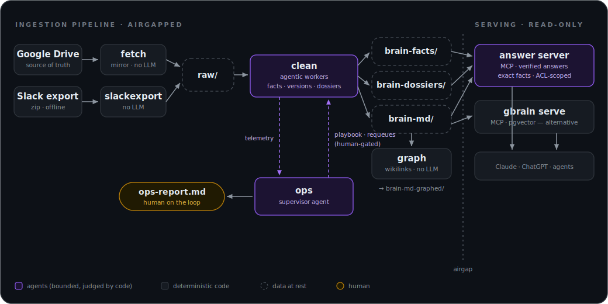
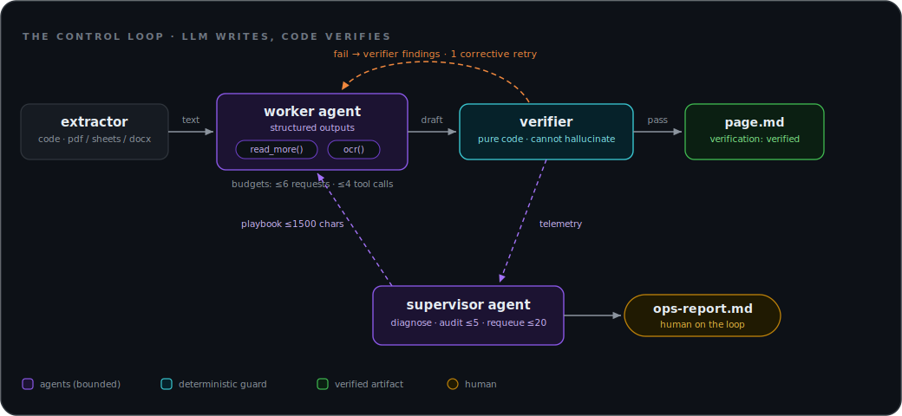

# cortex

[](https://github.com/sturlese/cortex/actions/workflows/ci.yml)
[](LICENSE)

**A blueprint for building a *company brain* out of a shared Google Drive — agentic where judgment
pays, deterministic where trust matters.**

cortex turns a messy Drive folder into a clean, entity-aware, **verified** Markdown knowledge base
and serves it to any MCP client (Claude, ChatGPT, agents). It is also an opinionated reference for
how to ship agentic systems in production: bounded autonomy, deterministic verification, auditable
memory, and a human on the loop.

<p align="center">
  
</p>

## The agentic control loop

Every document gets a worker agent; a supervisor agent watches the fleet. **Both are judged and
bounded by pure code** — the parts of the system that must never hallucinate, don't.

<p align="center">
  
</p>

The design in one sentence: **the LLM writes, code verifies; workers act, a supervisor learns;
every autonomous decision is budgeted, traced and reversible.**

## Try it in 2 minutes (no API keys)

```bash
make demo
```

Runs the entire loop over a fictional company drive: curation + dedup (`corpus`), page generation
with an offline fake LLM (`clean`), the entity graph (`graph`), and the **supervisor's report**
(`ops`). The fake backend **deliberately hallucinates two figures in one document and ties a real
figure to the wrong month in another** so you can watch the verifier catch both failure modes and
the judge loop correct them — look for `· self-corrected` in the log and `verify_retries: 2` in
the stats. Inspect `examples/out/`, then run `make eval` for the 9-metric golden scorecard. Swap
in `CLEAN_LLM=openai` + `OPENAI_API_KEY` for real pages.

## If you only have 5 minutes

| Look at | Why it's interesting |
|---|---|
| [`clean/src/verify.py`](pipeline/clean/src/clean/verify.py) | the trust layer: every figure on a page traced back to its source — and to the *period* the source gives it — deterministically. "Zero invention" AND "no misattribution" are *enforced*, and it judges the generator's retry |
| [`clean/src/agents.py`](pipeline/clean/src/clean/agents.py) + [`tools.py`](pipeline/clean/src/clean/tools.py) | bounded agency: tool-using workers where a clean doc still costs exactly 1 request |
| [`clean/src/ops.py`](pipeline/clean/src/clean/ops.py) | the supervisor: telemetry → diagnosis → sampled semantic audits → bounded actions → a report for a human |
| [`clean/src/playbook.py`](pipeline/clean/src/clean/playbook.py) | agent memory that cannot go feral: one auditable page, capped, advisory, kill-switched |
| [`evals/`](evals/) | golden scorecard run on every push: curation, placement, and the trust layer catching a **seeded hallucination** — quality measured, not assumed |
| [`docs/decisions/`](docs/decisions/) | four ADRs recording *why* — including what was deliberately NOT built |
| [`docs/pipeline/brain-page-contract.md`](docs/pipeline/brain-page-contract.md) | the page frontmatter treated as an API, with trust signals MCP clients act on |

## What's in the box

- **fetch** — deterministic incremental Drive mirror (deletions propagate). No LLM.
- **clean** — agentic workers with bounded autonomy: structured outputs, self-escalation to vision
  OCR, exact-content dedup, end-to-end deletion propagation, per-pass token budget, and the
  verifier-driven correction loop. Every page carries `verification:` and OCR provenance.
- **ops** — the supervisor agent: reads code-aggregated telemetry, spot-audits pages against
  freshly re-extracted sources, requeues bounded work, distills the workers' playbook, writes
  `ops-report.md`. Human-on-the-loop by construction.
- **graph** — derived entity graph from page mentions: node pages + wikilinks. No LLM.
- **corpus** — reproducible offline curation: taxonomy rules engine, md5 dedup, allowlist, inventory.
- **gbrain** *(deploy wrapper)* — the [gbrain](https://github.com/garrytan/gbrain) memory engine
  (Supabase + pgvector) behind a Tailscale Funnel, with per-client OAuth scoping over MCP.

Two independent Docker stacks, deliberately airgapped: the pipeline never sees the database; the
brain server never sees Drive. The only shared surface is the `brain-md` volume of Markdown pages.

## Quickstart (real corpus)

```bash
# 0) one-time shared volumes
docker volume create brain-md && docker volume create brain-md-graphed

# 1) ingestion pipeline
cd pipeline
cp .env.example .env          # DRIVE_FOLDER, OPENAI_API_KEY, gog keyring password
docker compose build && docker compose up -d    # clean is a no-op until CLEAN_DRY_RUN=false
docker compose --profile ops run --rm ops        # supervisor: diagnose + report + learn

# 2) brain server (optional — consume brain-md/ with anything you like)
cd ../gbrain
cp .env.example .env          # Supabase URL, embedding + Tailscale keys
make up
```

Details, folder conventions and the page contract: **[docs/](docs/README.md)**.

## Design principles

- **Bounded agency inside the document, determinism outside.** Paths, hashes, entity resolution,
  dedup, deletions and the graph are pure code; agents judge, write and escalate — within hard
  budgets, judged by a verifier that is pure code ([ADR 003](docs/decisions/003-bounded-agency-worker.md)).
- **Trust is checked, not assumed.** Self-reported quality is never the only signal
  ([ADR 002](docs/decisions/002-deterministic-verification.md)).
- **Memory on one auditable page.** The system learns through a capped, human-editable playbook —
  not an opaque vector store ([ADR 004](docs/decisions/004-supervisor-and-memory.md)).
- **Idempotent and resumable.** Everything keys off content hashes; kill it anytime and relaunch.
- **Single writer per artifact · least privilege.** No secrets in git, no DB credentials in the
  pipeline, read-only mounts wherever a stage only reads.

## Testing & observability

~220 tests across four packages (75% coverage gate in CI), including the real agents exercised
offline against their real tools, plus an [eval harness](evals/) that scores the whole system
against a golden set on every push — curation accuracy, placement, seeded-hallucination catch
rate, graph canonicalization. `CLEAN_TRACE=logfire` exports every agent run — prompts, tool calls,
retries — as OpenTelemetry spans (optional dependency).

```bash
make test    # all suites
make eval    # golden scorecard (offline)
make lint    # ruff
make demo    # the whole loop, offline
```

## License

[MIT](LICENSE)
